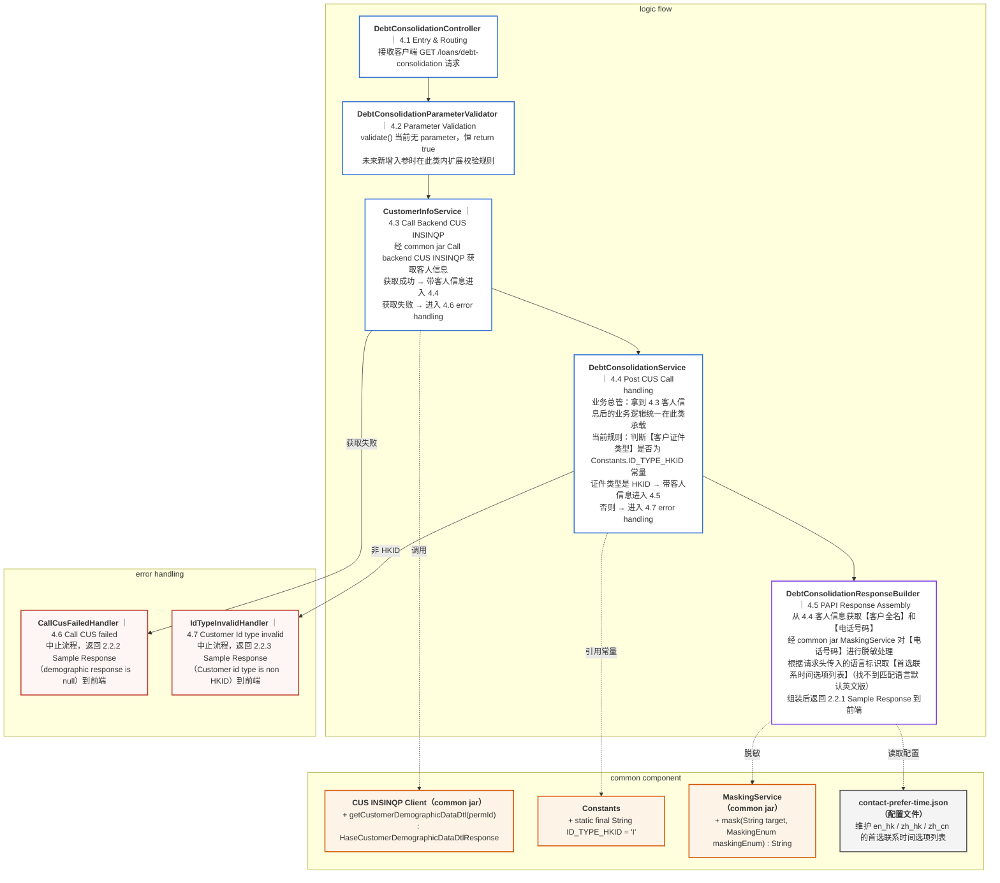

# GET /loans/debt-consolidation

> 三列视图：**common component**（原子能力 / 常量 / 配置）｜**logic flow**（本服务类，承接 4.x 逻辑）｜**error handling**（中止流程）

## 说明

- logic flow 列每个类承接一个 4.x 标题的逻辑，主流程自上而下：Controller → ParameterValidator → CustomerInfoService → DebtConsolidationService → DebtConsolidationResponseBuilder
- 虚线箭头（-.->）表示调用 common component：原子能力（common jar）/ 引用常量 / 读取配置文件
- 实线箭头（-->）指向 error handling 表示中止流程
- 两条中止分支统一收口在 error handling 列：
  - **2.2.2**：Call CUS failed（demographic response is null）
  - **2.2.3**：Customer Id type invalid（Customer id type is non HKID）

## 类清单

| 列 | 类 / 文件 | 承接章节 | 职责 |
|---|---|---|---|
| logic flow | DebtConsolidationController | 4.1 Entry & Routing | 接收客户端请求 |
| logic flow | DebtConsolidationParameterValidator | 4.2 Parameter Validation | 标准校验入口，当前恒 return true |
| logic flow | CustomerInfoService | 4.3 Call Backend CUS INSINQP | 经 common jar 获取客人信息 |
| logic flow | DebtConsolidationService | 4.4 Post CUS Call handling | 业务总管，当前规则：HKID 判断 |
| logic flow | DebtConsolidationResponseBuilder | 4.5 PAPI Response Assembly | 组装响应返回 2.2.1 |
| common component | CUS INSINQP Client（common jar） | 4.3 | getCustomerDemographicDataDtl(permId) |
| common component | Constants | 4.4 | static final String ID_TYPE_HKID = "I" |
| common component | MaskingService（common jar） | 4.5 | mask(target, MaskingEnum) |
| common component | contact-prefer-time.json（配置文件） | 4.5 | 维护 en_hk / zh_hk / zh_cn 的首选联系时间选项列表 |
| error handling | CallCusFailedHandler | 4.6 | 返回 2.2.2 Sample Response |
| error handling | IdTypeInvalidHandler | 4.7 | 返回 2.2.3 Sample Response |
